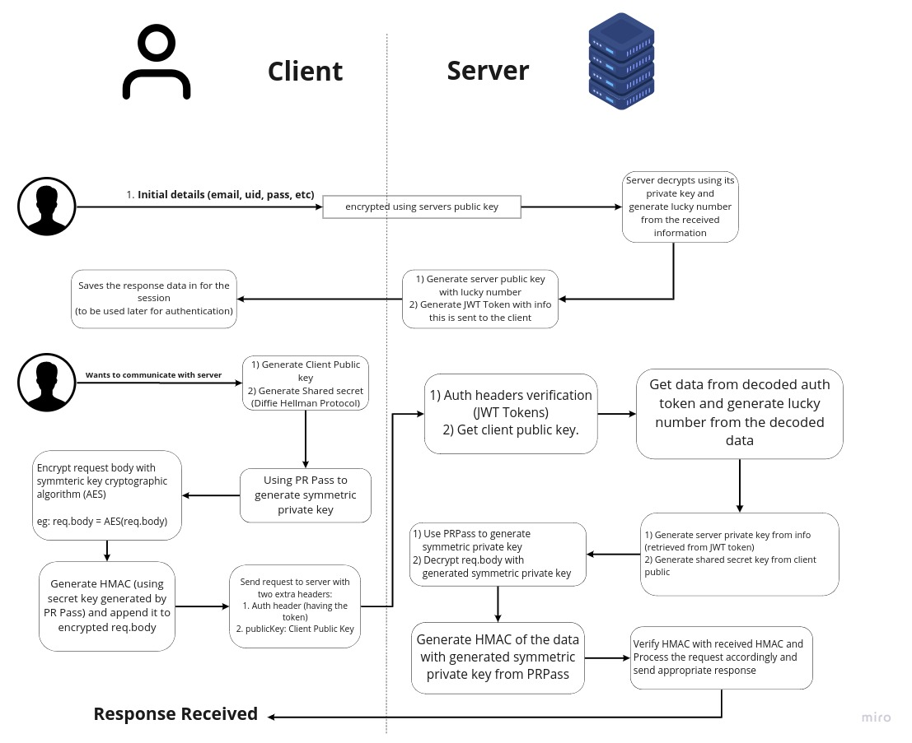
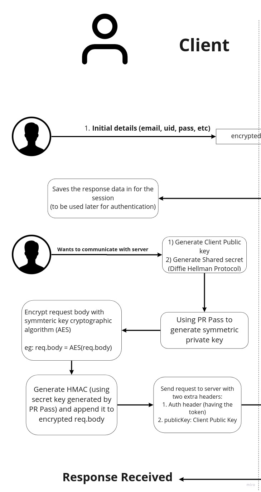
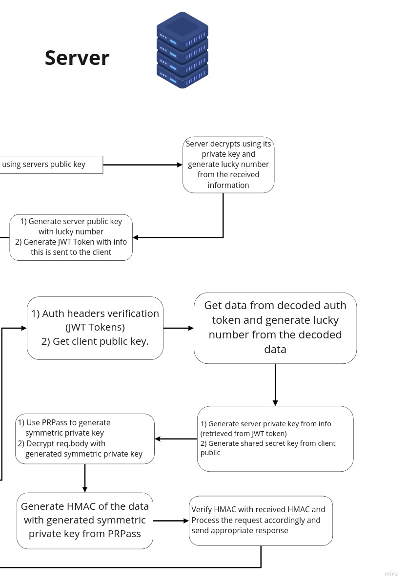

  <h3 align="center">Dynamic Symmetric Crypto System</h3>

  

    This Crypto System generates symmetric keys on the go dynamically to encrypt request body.
     
     
  

<!-- TABLE OF CONTENTS -->

  
Table of Contents

  <ol>
    <li>
      <a href="#about-the-project">About The Project</a>
      <ul>
        <li><a href="#built-with">Built With</a></li>
      </ul>
    </li>
    <li>
      <a href="#getting-started">Getting Started</a>
      <ul>
        <li><a href="#installation">Installation</a></li>
      </ul>
    </li>
    <li><a href="#usage">Usage</a></li>
    <li><a href="#contributing">Contributing</a></li>
    <li><a href="#license">License</a></li>
    <li><a href="#contact">Contact</a></li>
  </ol>

<!-- ABOUT THE PROJECT -->

## About The Project

### Built With

- JavaScript

<!-- GETTING STARTED -->

## Getting Started

## Usage

## Contributing

Contributions are what make the open source community such an amazing place to be learn, inspire, and create. Any contributions you make are **greatly appreciated**.

1. Fork the Project
2. Create your Feature Branch (`git checkout -b feature/AmazingFeature`)
3. Commit your Changes (`git commit -m 'Add some AmazingFeature'`)
4. Push to the Branch (`git push origin feature/AmazingFeature`)
5. Open a Pull Request

<!-- LICENSE -->

## License

Distributed under the MIT License. See `LICENSE` for more information.

# Development

## blockchain-voting

MIRO - https://miro.com/app/board/o9J_knPn4ZY=/

## Decrypt keys

openssl pkcs12 -info -in Staging_Signature_PrivateKey.p12 -nodes
(Password: public)

openssl x509 -pubkey -in uidai_auth_stage.cer -noout

## Diffie Hellman

    g = 17
    p = 541

## Postgres

pg_ctl -D /home/sudonims/Documents/blockchain-voting/postgres start
psql -h 127.0.0.1 -p 5432 -d voting
